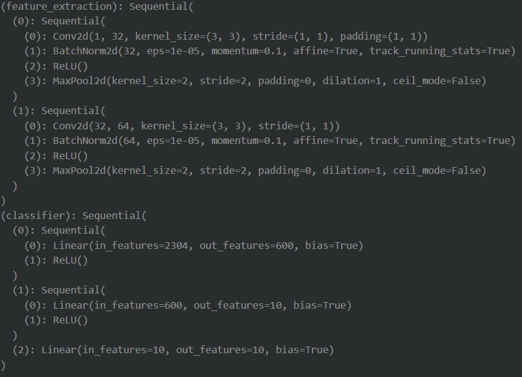
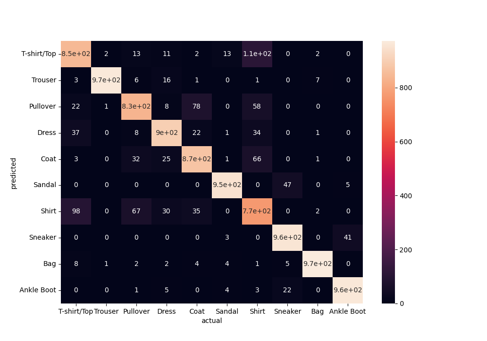
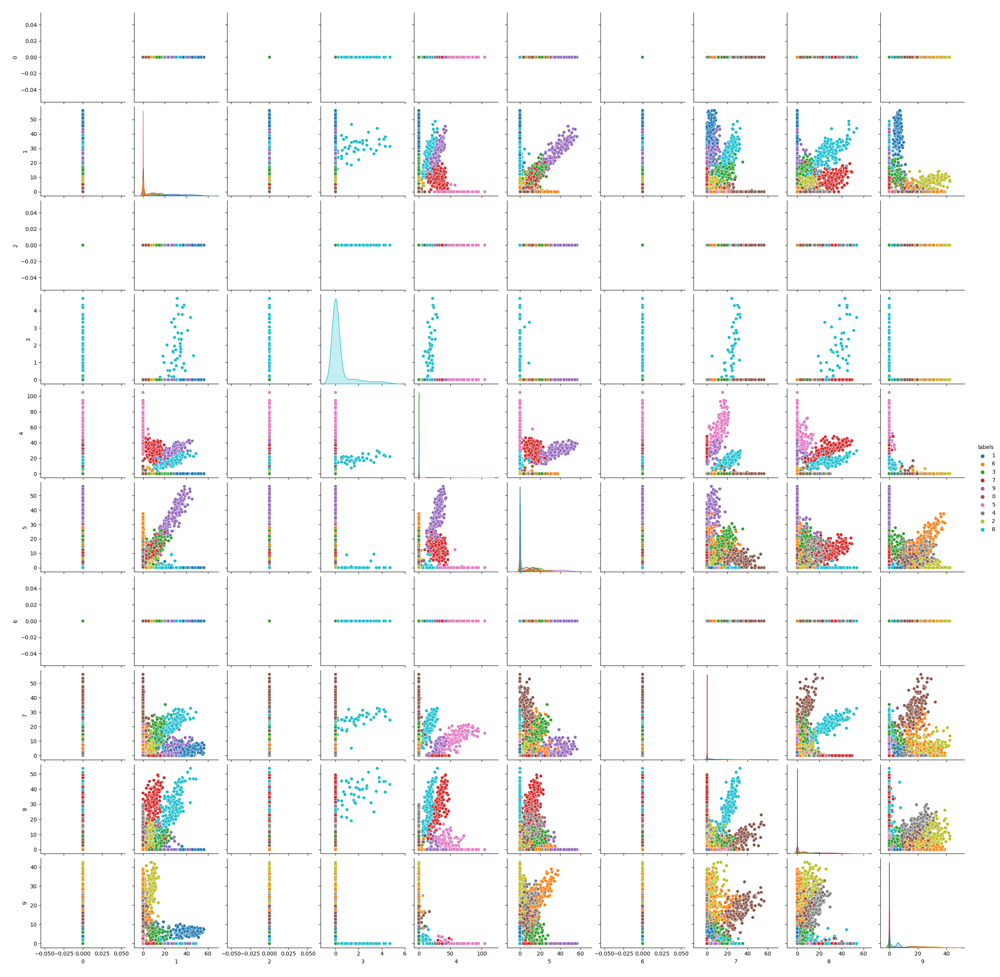
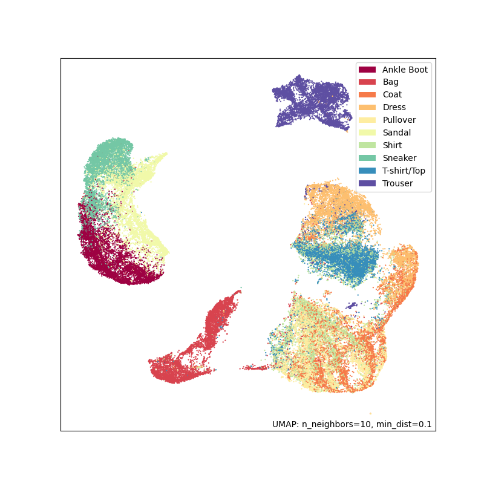

# Project1 - CAP6610

This project aims to use the basics of deep learning and implement the content learnt during lectures.

## Table of Contents
- [Project1 - CAP6610](#project1---cap6610)
  - [Table of Contents](#table-of-contents)
  - [Installation](#installation)
  - [Project Structure](#project-structure)
  - [Reproduce Results](#reproduce-results)
  - [Dataset](#dataset)
  - [Algorithms](#algorithms)
    - [MLP Layer](#mlp-layer)
    - [Support Vector Machine (SVM)](#support-vector-machine-svm)
    - [Random Forest](#random-forest)
    - [Least-Squares Classification](#least-squares-classification)
    - [Manifold Learning (UMAP)](#manifold-learning-umap)

<hr>

## Installation
Firstly, create a python environment.
```console
python -m venv venv
```
We activate the virutal environment. Depending on the OS
- For Linux:

    ```console
    source venv/bin/activate
    ```
- For Windows:

    ```console
    venv/Scripts/activate
    ```
Now, we install the necessary packages to run the algorithms such as torch, numpy, sklearn, etc:
```console
pip install -r requirements/requirements.txt
```
## Project Structure
- **Data**: where the dataset is stored once downloaded.
- **Models**: where we save the trained models *E.g., \*.pth*
- **Output**: saved plots.
- **utils**
  - *dataset.py*: dataset handler
  - *models.py*: model definition for SVM, MLP, LeastSquares, etc.
  - *utils.py*: utils for training and plotting
- *train_mlp.py*: training of complete mlp model for classification
- *train_least_squares.py*: model dissection and training of last least squares layer.
- *train_random_forest.py*: model dissection and training of random forest layer.
- *train_svm.py*: model dissection and training of last SVM layer.
- *visualization.ipynb*: visualization of latent space using UMAP (manifold learning).

## Reproduce Results

We used a seed in order to preserve reproducibility properties. And each file/algorithm can be executed with a default or custom seed. 

We show and example of execution:
```console
python train_mlp.py --l_rate=1e-3 --gamma=0.9 --n_epochs=5 --k=4 --batch_size=32 --save_path='models/best_model_cnn.pth'
```

## Dataset
We use the [FashionMNIST dataset](https://github.com/zalandoresearch/fashion-mnist), consisting of a training set of 60,000 examples and a test set of 10,000 examples. Each example is a 28x28 grayscale image, associated with a label from 10 classes. 

Furthermore, we have applied a k-fold cross validation over the train split. We have used k=4, but the k value can be modified.


<p align = "center">
Fig.1 - Fashion MNIST Dataset Sample
</p>

## Algorithms

### MLP Layer
```console
python train_mlp.py --l_rate=1e-3 --gamma=0.9 --n_epochs=5 --k=4 --batch_size=32 --save_path='models/best_model_cnn.pth'
```
We have tried multiple architectures such as a standard MLP, an MLP on top of a CNN feature extractor. In every case, it is able to achieve easily 90% over the test.

In Figure 2, we show the final model used. It consists of 2 parts: the feature extractor and the classifier.


<p align = "center">
Fig.2 - CNN Architecture
</p>

Finally, we obtain the following confusion matrix. We observe that the model misclassifies Shirt as T-shirt/Top, which makes sense.


<p align = "center">
Fig.3 - Confusion Matrix
</p>

We have also plotted the 10 features of the last layer in the following plot:


<p align = "center">
Fig.3 - Features plot of last layer
</p>

### Support Vector Machine (SVM)
Train Support Vector Machine (SVM) on top of MLP:
```console
python train_svm.py --l_rate=1e-3 --gamma=0.9 --n_epochs --k=4 --batch_size=32 --load_path='models/best_model_cnn.pth'
--save_path='models/best_model_svm.pth' --seed=1234 --stop_layer='fc2' --get_input=False
```
The parameters are explained in the Python file. We show an example down below:
```python
if __name__ == '__main__':
    parser = argparse.ArgumentParser()
    parser.add_argument('--l_rate', type=float, default=1e-3, help='learning rate')
    parser.add_argument('--gamma', type=float, default=0.9, help='gamma parameter for optimizer scheduler')   
    parser.add_argument('--n_epochs', type=int, default=1, help='number of epochs')
    parser.add_argument('--k', type=int, default=2, help='k parameter in k-fold validation')
    parser.add_argument('--batch_size', type=int, default=32, help='batch size')
    parser.add_argument('--load_path', type=str, default='models/best_model_cnn.pth', help='best model saved path')
    parser.add_argument('--save_path', type=str, default='models/best_model_svm.pth')
    parser.add_argument('--seed', type=int, default=1234)
    parser.add_argument('--stop_layer', type=str, default='fc2')
    parser.add_argument('--get_input', type=bool, default=False, help='whether to detach the input or the output of the layer')
    kwargs = parser.parse_args()

```
### Random Forest
Train Random Forest on top of MLP:
```console
python train_random_forest.py --l_rate=1e-3 --gamma=0.9 --n_epochs --k=4 --batch_size=32 --load_path='models/best_model_cnn.pth'
--save_path='models/best_model_svm.pth' --seed=1234 --stop_layer='fc2' --get_input=False
```

### Least-Squares Classification
Train Least Squares on top of MLP:
```console
python train_least_squares.py --l_rate=1e-3 --gamma=0.9 --n_epochs --k=4 --batch_size=32 --load_path='models/best_model_cnn.pth'
--save_path='models/best_model_svm.pth' --seed=1234 --stop_layer='fc2' --get_input=False
```

### Manifold Learning (UMAP)
We apply UMAP algorithm to reduce the dimensionality to 2 dimensions and we plot each class. We notice that the furthest the layer, the better clustering between classes.
|UMAP over raw data|Output layer 2|Output fc2|
|:-:|:-:|:-:|
||.png)|.png) |